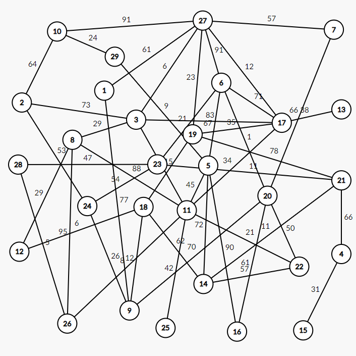

## 1.文件说明

- Graph.txt: 用三维数组存储边的两个端点和边的长度
- gps.cpp: 主函数

## 2.实现效果

```
请输入起点和终点：1 3
```

```
通过深度优先遍历共为您规划了30条线路
第1条线路：1 9 18 12 8 3 
第2条线路：1 9 18 12 8 11 3 
第3条线路：1 9 18 12 8 11 5 6 17 3 
第4条线路：1 9 18 12 8 11 5 6 17 19 21 14 22 20 7 27 3      
第5条线路：1 9 18 12 8 11 5 6 17 19 21 14 22 20 7 27 10 2 3 
第6条线路：1 9 18 12 8 11 5 6 17 19 21 23 24 2 3 
第7条线路：1 9 18 12 8 11 5 6 17 19 21 23 24 2 10 27 3      
第8条线路：1 9 18 12 8 11 5 6 17 19 27 3 
第9条线路：1 9 18 12 8 11 5 6 17 19 27 7 20 22 14 21 23 24 2 3 
第10条线路：1 9 18 12 8 11 5 6 17 19 27 10 2 3 
第11条线路：1 9 18 12 8 11 5 6 17 27 3 
第12条线路：1 9 18 12 8 11 5 6 17 27 7 20 22 14 21 23 24 2 3   
第13条线路：1 9 18 12 8 11 5 6 17 27 10 2 3 
第14条线路：1 9 18 12 8 11 5 6 17 27 19 21 23 24 2 3 
第15条线路：1 9 18 12 8 11 5 6 20 7 27 3 
第16条线路：1 9 18 12 8 11 5 6 20 7 27 10 2 3 
第17条线路：1 9 18 12 8 11 5 6 20 7 27 10 2 24 23 21 19 17 3   
第18条线路：1 9 18 12 8 11 5 6 20 7 27 17 3 
第19条线路：1 9 18 12 8 11 5 6 20 7 27 17 19 21 23 24 2 3      
第20条线路：1 9 18 12 8 11 5 6 20 7 27 19 17 3 
第21条线路：1 9 18 12 8 11 5 6 20 7 27 19 21 23 24 2 3         
第22条线路：1 9 18 12 8 11 5 6 20 22 14 21 19 17 3 
第23条线路：1 9 18 12 8 11 5 6 20 22 14 21 19 17 27 3         
第24条线路：1 9 18 12 8 11 5 6 20 22 14 21 19 17 27 10 2 3    
第25条线路：1 9 18 12 8 11 5 6 20 22 14 21 19 27 3 
第26条线路：1 9 18 12 8 11 5 6 20 22 14 21 19 27 10 2 3       
第27条线路：1 9 18 12 8 11 5 6 20 22 14 21 19 27 17 3         
第28条线路：1 9 18 12 8 11 5 6 20 22 14 21 23 24 2 3 
第29条线路：1 9 18 12 8 11 5 6 20 22 14 21 23 24 2 10 27 3    
第30条线路：1 9 18 12 8 11 5 6 20 22 14 21 23 24 2 10 27 17 3 
```

```
通过宽度优先遍历共为您规划了55条线路
第1条线路：1->27->3
第2条线路：1->27->17->3
第3条线路：1->27->6->17->3
第4条线路：1->9->20->6->17->3
第5条线路：1->9->24->2->3
第6条线路：1->27->10->2->3
第7条线路：1->27->17->11->3
第8条线路：1->27->6->17->11->3
第9条线路：1->9->20->6->17->11->3
第10条线路：1->9->20->22->11->3
第11条线路：1->9->18->14->22->11->3
第12条线路：1->27->6->5->11->3
第13条线路：1->9->20->6->5->11->3
第14条线路：1->9->18->14->5->11->3
第15条线路：1->9->20->16->5->11->3
第16条线路：1->9->18->12->8->3
第17条线路：1->27->17->11->8->3
第18条线路：1->27->6->17->11->8->3
第19条线路：1->9->20->6->17->11->8->3
第20条线路：1->9->20->22->11->8->3
第21条线路：1->9->18->14->22->11->8->3
第22条线路：1->27->6->5->11->8->3
第23条线路：1->9->20->6->5->11->8->3
第24条线路：1->9->18->14->5->11->8->3
第25条线路：1->9->20->16->5->11->8->3
第26条线路：1->27->17->11->26->8->3
第27条线路：1->27->6->17->11->26->8->3
第28条线路：1->9->20->6->17->11->26->8->3
第29条线路：1->9->20->22->11->26->8->3
第30条线路：1->9->18->14->22->11->26->8->3
第31条线路：1->27->6->5->11->26->8->3
第32条线路：1->9->20->6->5->11->26->8->3
第33条线路：1->9->18->14->5->11->26->8->3
第34条线路：1->9->20->16->5->11->26->8->3
第35条线路：1->9->24->23->28->26->8->3
第36条线路：1->27->6->23->28->26->8->3
第37条线路：1->9->20->6->23->28->26->8->3
第38条线路：1->9->18->12->8->11->3
第39条线路：1->9->18->12->8->26->11->3
第40条线路：1->9->24->23->28->26->11->3
第41条线路：1->27->6->23->28->26->11->3
第42条线路：1->9->20->6->23->28->26->11->3
第43条线路：1->27->19->17->3
第44条线路：1->9->18->19->17->3
第45条线路：1->9->20->22->11->17->3
第46条线路：1->9->18->14->22->11->17->3
第47条线路：1->27->6->5->11->17->3
第48条线路：1->9->20->6->5->11->17->3
第49条线路：1->9->18->14->5->11->17->3
第50条线路：1->9->20->16->5->11->17->3
第51条线路：1->9->20->6->27->3
第52条线路：1->9->20->7->27->3
第53条线路：1->9->20->6->17->27->3
第54条线路：1->9->18->19->27->3
第55条线路：1->9->20->6->17->19->27->3
```

```
最短路线为：1-->27-->3 该路线距离为：67
```

